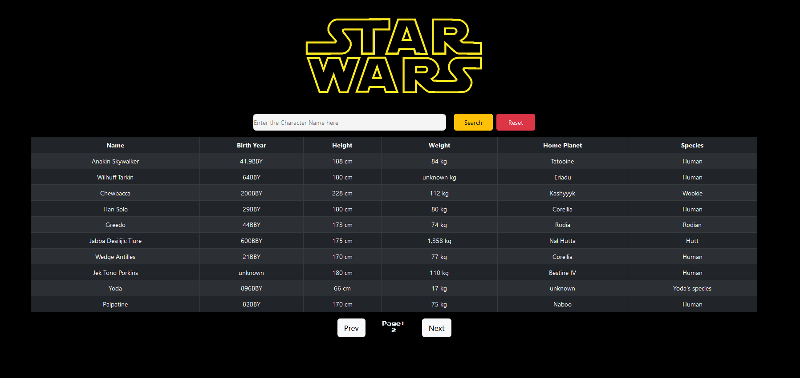

# This App is currently down while being migrated to render.com

# Star Wars API Application

## Task 8 in Software Development Mastermind

This application utilizes React.js, React Bootstrap, asynchronous Javascript, the axios library, and the Star Wars API.

It can be accessed [here](https://star-wars-api-ecw.herokuapp.com/)

## Summary

This application created in React.js uses the axios library to send GET requests to swapi.dev. The challenge of this application was making subsequent calls to request data that is only accessible after the first call is made. For each characters home planet and species, separate URLs most have GET requests sent in order to properly populated the data. The search functionality creates another GET request, and is not case sensitive. It will return the specific characters row. The reset button will create the original API call and send the user back to page 1.

## Author

-   Elijah C Walker - Software Developer/Systems Engineer
